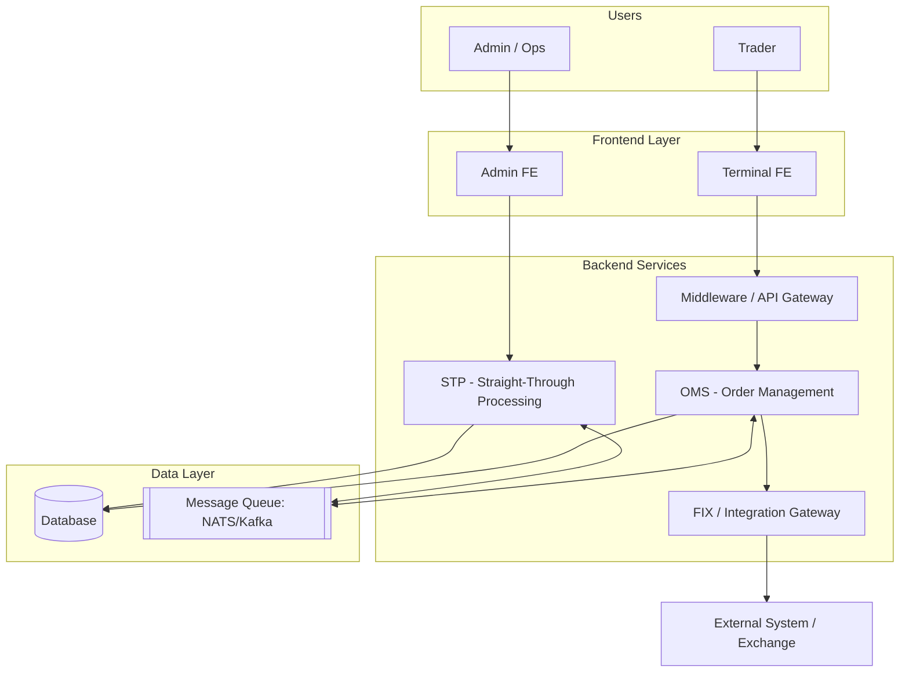
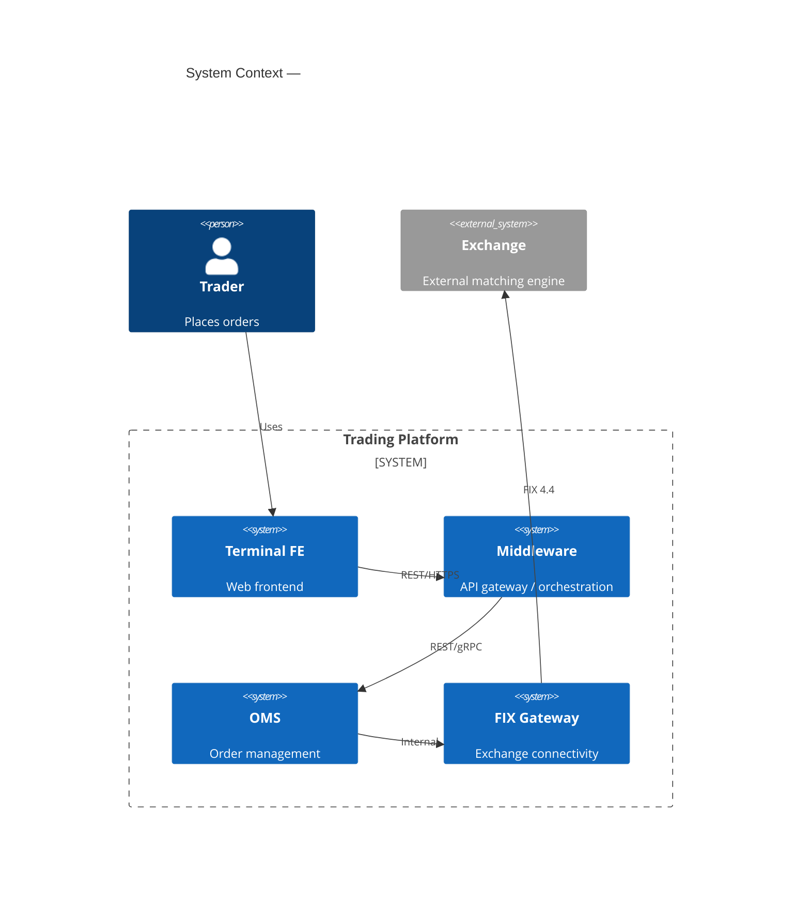
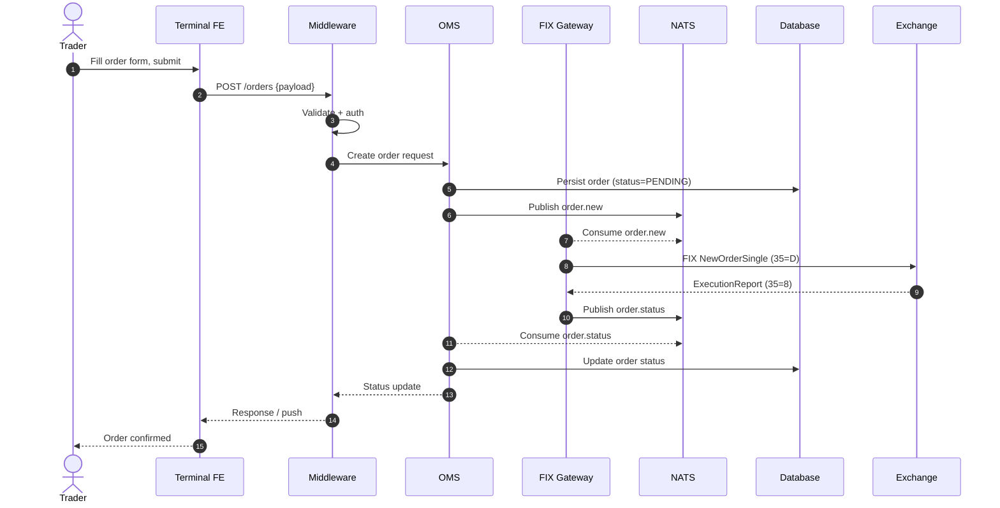

# Mermaid Diagram Patterns

Copy-ready templates. Use Mermaid v11 syntax. For advanced syntax rules, activate the `mermaidjs-v11` skill.

## 1. Architecture / C4 System Context (flowchart style)

Reliable across all Mermaid renderers — prefer this over the native `C4Context` block.

## 2. Native C4 Context (when renderer supports it)

## 3. Sequence Diagram — business flow across services

## Diagram Rules

- One concern per diagram; split rather than overload.
- Use `autonumber` in sequence diagrams for step traceability.
- Label every relationship/arrow with the protocol or message type.
- Keep participant names consistent with Part 1 service names.
- Validate Mermaid renders before finalizing (preview skill or markdown viewer).